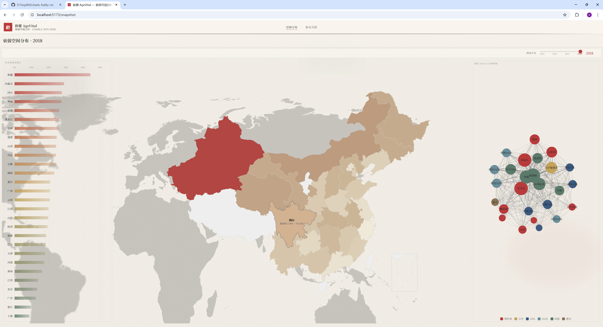
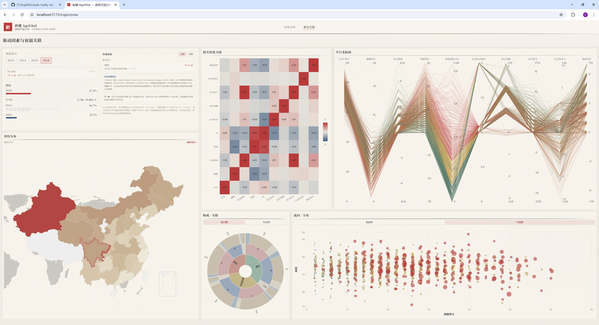
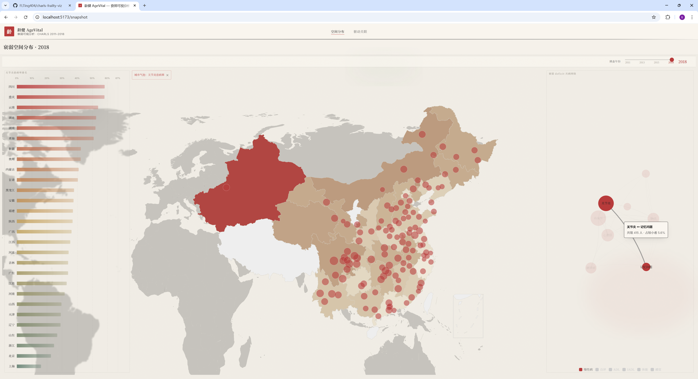
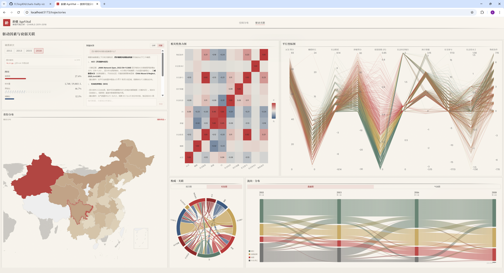

# 龄健 AgeVital

**中国中老年人衰弱状态及多维驱动因素可视分析系统**

浙江大学 · 数据可视化导论 · 课程大作业 · CHARLS 2011–2018

**在线演示**：https://flting404.github.io/charls-frailty-viz/

---

## 项目简介

AgeVital 基于 CHARLS 2011–2018 四波次纵向队列数据，集成 10+ 可视化视图与 AI 异常检测 / 智能问答，支持从空间格局、个体轨迹、因素关联、人口构成四个层面交互式探索中国老年衰弱现象。

---

## 快速上手

### 环境配置

#### Node.js

- **要求版本：Node.js v22.x**（开发与构建均使用 **v22.18.0**）
- 推荐使用 [nvm-windows](https://github.com/coreybutler/nvm-windows) 或 [nvm](https://github.com/nvm-sh/nvm) 管理版本：

```bash
nvm install 22
nvm use 22
node -v  # 确认输出 v22.x.x
```

- 也可直接从 [Node.js 官网](https://nodejs.org/) 下载 v22 LTS 安装包

#### 包管理器

- 使用 npm（随 Node.js 附带，无需额外安装）

#### 操作系统

- Windows / macOS / Linux 均可

> 可视化数据（44 个 JSON）和地图 GeoJSON 已包含在仓库中，无需额外下载或生成。

### 安装与启动

```bash
cd Agevital
npm install      # 安装依赖
npm run dev      # 启动开发服务器
```

浏览器打开 http://localhost:5173 即可使用：

- **快照页** `/snapshot` — 衰弱空间分布 + 共病网络
- **轨迹页** `/trajectories` — 多维驱动因素分析

---

### 开启 AI 分析功能（可选）

系统内置 AI 异常检测和智能问答功能，需要 DeepSeek API Key 才能使用。不配置也不影响其他功能正常运行（AI 面板会显示预设的离线分析结果）。

1. 在 [platform.deepseek.com](https://platform.deepseek.com) 注册并获取 API Key
2. 在 `Agevital/` 目录下创建 `.env` 文件：

```
DEEPSEEK_API_KEY=sk-你的密钥
```

3. 重启 `npm run dev`，Vite 会自动读取密钥并代理请求到 DeepSeek API

> AI 功能在轨迹页左侧「发现面板」和快照页底部的「智能问答」入口使用。点击聊天气泡图标即可打开问答界面，系统会基于当前数据上下文 + CHARLS 文献知识库回答问题。

---

## 页面功能

### 快照页 `/snapshot`

| 区域           | 功能                                                       |
| -------------- | ---------------------------------------------------------- |
| 中国地图       | 颜色深浅反映各省衰弱率；点击省份跳转轨迹页并自动筛选       |
| 左侧排名柱状图 | 按衰弱率降序排列；点击共病网络节点后切换为该缺陷患病率排名 |
| 共病力导向图   | 26 项衰弱缺陷的共病网络；点击节点 → 地图叠加城市气泡      |
| 顶部年份选择器 | 切换 2011 / 2013 / 2015 / 2018                             |

### 轨迹页 `/trajectories`

| 区域                | 功能                                           |
| ------------------- | ---------------------------------------------- |
| 左侧地图 + 统计卡   | 点击省份筛选；统计卡显示当前范围摘要           |
| 发现面板 / 智能问答 | AI 异常分析 + 基于 CHARLS 文献的智能问答       |
| 相关性热力图        | Spearman ρ 矩阵，点击单元格设焦点变量         |
| 平行坐标图          | 个体级十维驱动因素；拖拽框选子群，联动下方图表 |
| 桑基图 / 气泡图     | 衰弱状态跨波次流转 / 驱动因素散点              |
| 旭日图 / 和弦图     | 人口构成分布 / 驱动因素间关联强度              |

**系统截图**









---

## 技术栈

| 层级     | 技术                                                                              |
| -------- | --------------------------------------------------------------------------------- |
| 前端框架 | Vite 5 + React 18 + TypeScript                                                    |
| 样式     | Tailwind CSS 3 + shadcn/ui + 水墨主题                                             |
| 图表     | ECharts 5（地图 / 力导向 / 旭日 / 桑基 / 和弦 / 平行坐标 / 热力图 / 散点 / 柱状） |
| 状态管理 | Zustand                                                                           |
| AI       | DeepSeek API + 预设离线分析 + CHARLS 文献 RAG                                     |
| 数据处理 | Python 3 · pandas · scipy · pyreadstat（仅数据预处理阶段需要）                 |

---

## 常见问题

**省份点击后轨迹页无数据**

检查 `Agevital/public/data/` 下的 `driver_records_{year}.json` 是否完整。

---

## 数据来源

CHARLS（中国健康与养老追踪调查）2011–2018，北京大学国家发展研究院。申请地址：[charls.pku.edu.cn](https://charls.pku.edu.cn)

> 本项目为课程作业，代码仅供学术参考，请勿将 CHARLS 原始微观数据公开分发。
