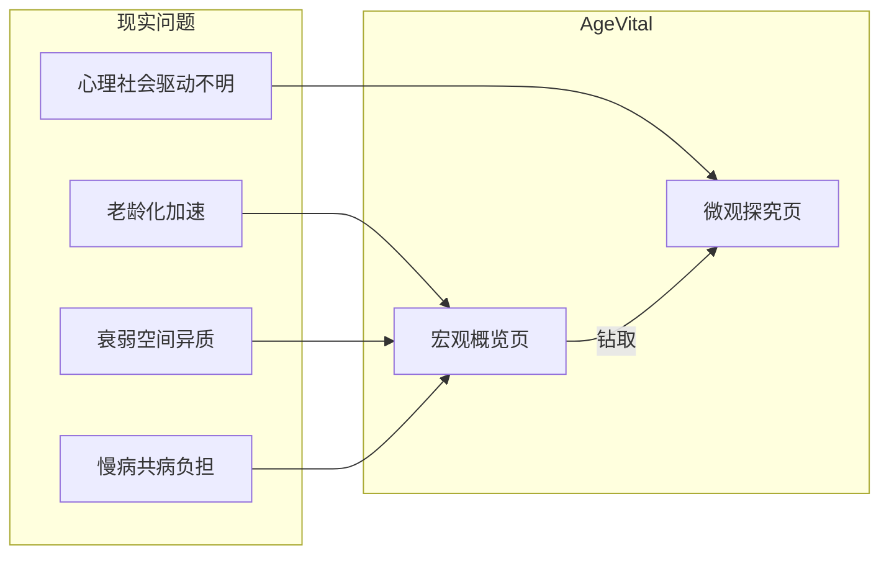
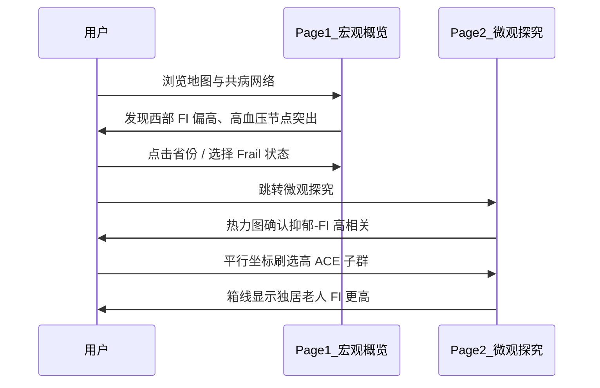
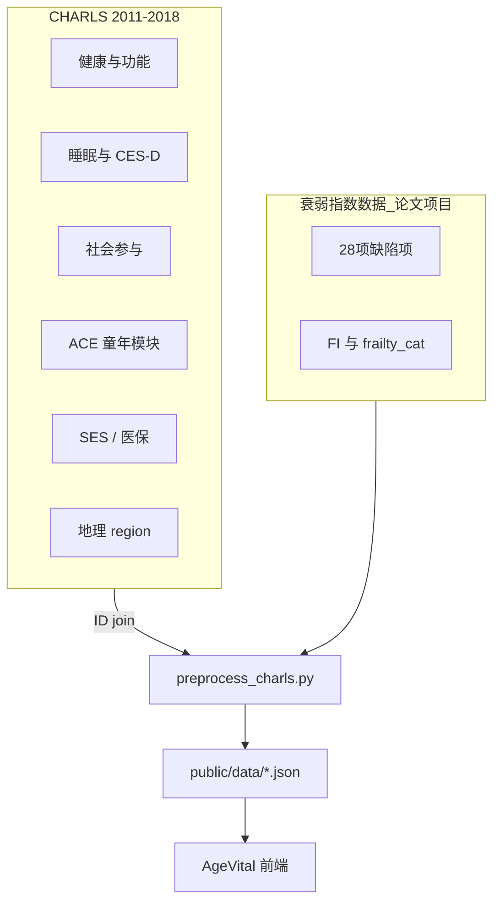
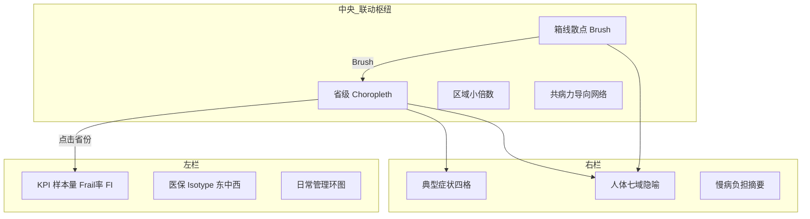
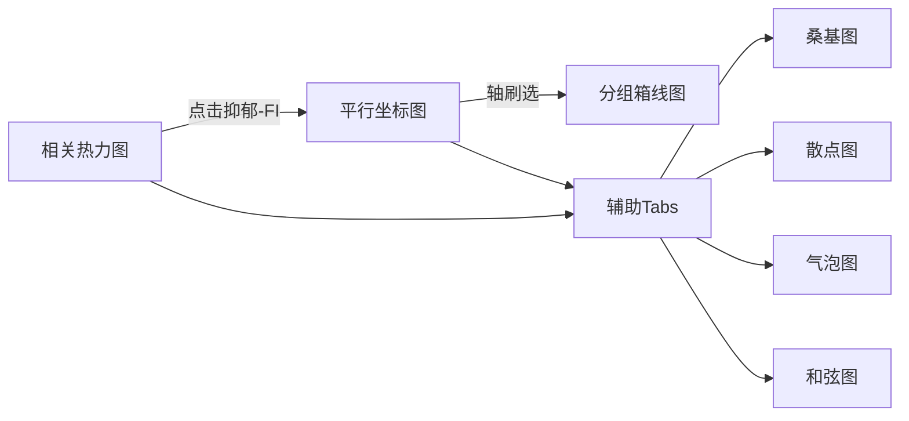
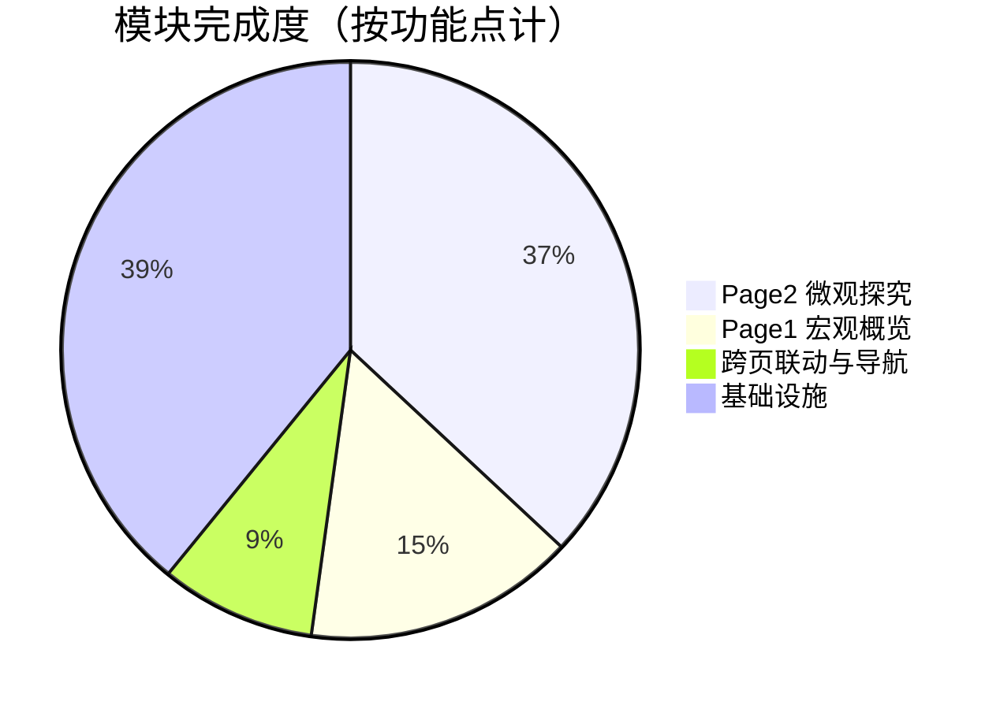
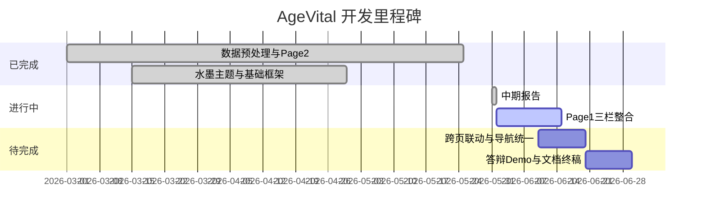

# AgeVital：中国中老年人衰弱可视分析系统

## 中期设计报告

**课程：** 浙江大学 · 可视化导论 · 2026  
**项目：** 龄健 AgeVital — CHARLS 2011–2018  
**文档版本：** 中期检查 · 2026-05

---

## 目录

1. [项目背景](#1-项目背景)
2. [分析任务定义](#2-分析任务定义)
3. [数据说明](#3-数据说明)
4. [设计方案](#4-设计方案)
5. [目前实现进展](#5-目前实现进展)
6. [待完成工作](#6-待完成工作)
7. [参考文献](#7-参考文献)

---

## 1. 项目背景

### 1.1 社会背景

中国已进入中度老龄化社会：60 岁以上人口超过 3 亿，占总人口 21% 以上。在老年健康研究中，**衰弱（Frailty）** 是比"年龄"更能预测跌倒、住院、失能和死亡的综合指标。衰弱反映个体生理储备下降、对应激易感性增加的状态，常用 **Frailty Index（FI，衰弱指数）** 量化——即个体所累积健康缺陷占有效评估项的比例（Rockwood & Mitnitski, 2007）。

然而，全国尺度的衰弱空间格局、伴随的慢病负担，以及心理社会因素的驱动机制，仍缺乏面向政策制定者与研究者的**交互式可视分析工具**。

### 1.2 项目定位

**AgeVital（龄健）** 是基于 CHARLS 四波追踪数据（2011 / 2013 / 2015 / 2018）构建的双页 Web 可视分析系统，采用 **Chinese Ink-Wash（水墨）** 视觉风格与中文界面，目标用户为可视化课程答辩、公共卫生方向探索性分析。



### 1.3 为什么选择可视化

| 方法 | 局限 |
|------|------|
| 传统回归 | 难以展示空间异质性与个体层面多因素共现 |
| 机器学习 | 黑箱，不利于交互式子群探索 |
| 静态报表 | 无法联动「选省 → 刷症状 → 看因素」 |

可视化通过 **Overview → Zoom & Filter → Details-on-Demand**（Shneiderman, 1996）与 **多视图联动**（Roberts, 2007），将宏观空间格局与微观因素归因串联为可探索的分析叙事。

---

## 2. 分析任务定义

系统围绕两个核心问题，对应双页结构：

| 页面 | 核心问题 | 分析视角 |
|------|---------|---------|
| **Page 1 · 宏观概览** | 中国各地区衰弱情况如何？衰弱人群通常伴随哪些严重生理指标（如高血压）？ | 空间 · 截面 · 生理共病 |
| **Page 2 · 微观探究** | 心理、社会与生活方式因素如何多维归因于衰弱？ | 个体 · 关联 · 刷选下钻 |

### 2.1 分析任务清单

| 任务 ID | 分析任务 | 操作类型 | 承载模块 |
|---------|---------|---------|---------|
| **T1** | 探索全国 / 分省 / 分区的 FI 与衰弱率空间格局 | 空间 / 总览 | 省级地图、区域小倍数 |
| **T2** | 理解衰弱人群的高血压、糖尿病等慢病与 ADL 症状负担 | 比较 / 关系 | 症状栏、人体隐喻、共病网络 |
| **T3** | 比较东中西 / 城乡 / 性别群体的 FI 分布差异 | 分布 / 比较 | 箱线散点、KPI |
| **T4** | 探索 ACE、抑郁、睡眠、社会联系与 FI 的相关结构 | 关系 / 过滤 | 相关热力图、平行坐标 |
| **T5** | 刷选高 ACE / 高抑郁子群，观察流向短睡眠、高 FI | 探索 / 细节 | 轴刷选、分组箱线 |
| **T6** | 跨页钻取：从宏观高危区域进入微观因素分析 | 叙事 / 钻取 | URL 参数联动 |

### 2.2 叙事结构

参考 Segel & Heer (2010) 的 **Martini Glass** 叙事模型：Page 1 以作者驱动建立全景（Author-driven），Page 2 以读者驱动自由探索（Reader-driven），形成「哪里 → 什么症状 → 为什么」的闭环。



---

## 3. 数据说明

### 3.1 数据总览

本项目使用两类数据：**CHARLS 公开调查数据**（多主题模块）与**团队自建的衰弱指数数据**（来自并行科研项目）。二者通过个体 `ID` 在预处理阶段合并。



### 3.2 CHARLS 调查数据

**来源：** 北京大学 CHARLS（[charls.pku.edu.cn](https://charls.pku.edu.cn/)）  
**波次：** 2011 / 2013 / 2015 / 2018  
**用途：** 地理区域、慢病与 ADL 字段、睡眠 / 抑郁、社会参与、ACE、社会经济等协变量

| 主题模块 | 文件位置（清洗后） | 主要变量 | 可视化用途 |
|---------|------------------|---------|-----------|
| 健康与功能 | 合并自 H 模块 | 慢病、ADL/IADL、自评健康 | 共病网络、症状栏 |
| 睡眠 | `charls_sleep_by_wave/` | `sleep`, `cesd10` | Page 2 睡眠 / 抑郁维度 |
| 社会参与 | `charls_social_participation_by_wave/` | `*_f` 活动频率 | 社会联系指数 |
| 童年逆境 | `charls_ace/` | `ace_sum` | Page 2 ACE 维度 |
| 社会经济 | `charls_socialeconomic_status/` | `raeducl`, `atotb` | 因素矩阵 / 环图 |
| 医疗保健 | `charls_healthcare_system/` | `higov` 等 | 医保 Isotype |
| 物质环境 | `charls_material_circumstances/` | `region`（东/中/西） | 区域对比、地图着色 |

变量 harmonization 参照 [`CHARLS_ELSA_HRS 变量汇总.xlsx`](../data/CHARLS_ELSA_HRS%20变量汇总.xlsx)（CHARLS / ELSA / HRS 三库对照表；当前实现以 CHARLS 列为准）。

> **说明：** 原始 Stata（`.dta`）文件体积较大（约 800 MB+），不纳入 Git 仓库；清洗后 CSV 存放于本地 `data/` 目录，详见 `.gitignore` 与 README。

### 3.3 衰弱指数数据（并行科研项目）

**来源说明：** FI 及 `frailty_cat` 并非直接使用 CHARLS 官方发布字段，而是来自团队**目前正在投稿的衰弱构建研究**（独立科研项目）。该工作基于 Rockwood 缺陷累积模型，对 CHARLS 2011–2018 各波调查数据进行清洗、多重插补与标准化处理，输出个体级 FI 及三分类结局。

| 项目 | 说明 |
|------|------|
| 构建方法 | 缺陷累积 Frailty Index（FI = deficit_sum / n_valid） |
| 缺陷域 | 慢性病、自评健康、ADL、IADL、体能、感官等约 28 项 |
| 分类阈值 | FI ≥ 0.25 → 衰弱；≥ 0.10 → 衰弱前期；否则健壮 |
| 工程产物 | `charls_frailty/charls_frailty_{year}.csv` |
| 构建脚本 | `charls_frailty/CHARLS-Frailty.Rmd`（R 语言） |

本课程可视化项目**直接调用上述已构建好的 FI 数据**作为核心结局变量，不在本仓库中重复展开 FI 构建的统计细节；论文发表后可在报告中补充正式引用。

### 3.4 样本规模与关键统计

| 年份 | 样本量 | 健壮 | 衰弱前期 | 衰弱 |
|------|--------|------|---------|------|
| 2011 | 43,182 | 58.2% | 11.4% | 11.8% |
| 2018 | 25,586 | 36.0% | 25.2% | **16.3%** |

**2018 波次驱动因素相关（Spearman ρ）：**

| 变量对 | ρ | 解读 |
|--------|---|------|
| 抑郁 – FI | **+0.43** | 最强正相关驱动因素 |
| 睡眠时长 – FI | −0.24 | 睡眠越短，FI 倾向越高 |
| 社会联系 – FI | −0.14 | 参与越多，FI 略低 |
| ACE – FI | +0.06 | 弱正相关 |

### 3.5 数据预处理流水线

```
code/data/*.csv
    │
    ▼  python scripts/preprocess_charls.py
    │
    ├── map_province_{year}.json      ← Page 1 地图
    ├── deficit_network_{year}.json   ← Page 1 共病网络
    ├── symptoms / body_domains / kpi / boxplot …
    ├── correlation_matrix_{year}.json ← Page 2 热力图
    └── driver_records / sankey / chord …
    │
    ▼  npm run dev → fetch public/data/
```

---

## 4. 设计方案

### 4.1 双页总体架构

| 页面 | 路由 | 导航（规划） | 设计层次 |
|------|------|------------|---------|
| **Page 1** | `/snapshot` | 宏观概览 | Overview：空间 + 生理截面 |
| **Page 2** | `/trajectories` | 微观探究 | Zoom & Filter：多维归因 |

**布局参考：** 课程参考信息图《Diabetes Data Visualization Design》的 **Partitioned Poster（分区海报）** 结构——左栏 KPI / 中栏地图 / 右栏症状与人体。本系统以水墨风格独立演绎。


*图 1 · 参考信息图布局（`reference/张彦洁1.86bd1459.png`）：左栏基础数据、中央地图、右栏症状与人体并发症。*

### 4.2 视觉设计规范

| 元素 | 色值 / 规范 | 用途 |
|------|------------|------|
| 宣纸背景 | `#F7F3EB` | 页面底色 |
| 主墨色 | `#1C1C1C` | 标题、轴线 |
| 朱砂点缀 | `#B83B3B` | Frail 警示、选中高亮 |
| 健壮 / 前期 / 衰弱 | `#5C7A6B` / `#C4A35A` / `#B83B3B` | 全系统语义色 |
| 字体 | Noto Serif SC + Inter | 标题 + 数据 |
| 布局 | 12 列 Grid | Page 1 三栏 3+6+3 |

### 4.3 Page 1 设计方案：宏观概览

**设计目标：** 回答「哪里衰弱重？」「伴随哪些生理指标？」

```
╔══════════════════════════════════════════════════════════════════════════╗
║  宏观概览 · AgeVital        年份 [2011|2013|2015|2018]   [→ 微观探究]   ║
╠═══════════════╦══════════════════════════════════╦═══════════════════════╣
║  左栏 25%     ║  中央 50%                         ║  右栏 25%            ║
║  KPI 大字统计 ║  中国省级 Choropleth（水墨填色）     ║  典型症状四格         ║
║  医保 Isotype ║  东/中/西 区域小倍数                 ║  人体七域隐喻         ║
║  日常管理环图 ║  慢病共病力导向网络                  ║  慢病负担摘要         ║
║               ║  分区域 FI 箱线 + 散点刷选           ║                       ║
╚═══════════════╩══════════════════════════════════╩═══════════════════════╝
```



**核心交互：**

- 地图点击省份 → 左栏 KPI、右栏症状、底部箱线同步过滤
- 顶栏切换 Robust / Pre-Frail / Frail → 共病网络节点大小重算
- 箱线 Brush 框选极端个体 → 地图高亮对应分布
- 「微观探究」按钮 → 携带 `year` + `status` + `province` 跳转 Page 2

**模块与图表类型：**

| 模块 | 图表 | 理论依据 |
|------|------|---------|
| P1-C1 省级地图 | Choropleth | MacEachren (1995) |
| P1-C2 区域小倍数 | 图标矩阵 | Tufte 小倍数原则 |
| P1-C3 共病网络 | 力导向图 | 缺陷累积理论 (Rockwood, 2007) |
| P1-R2 人体隐喻 | SVG Callout + Tooltip | Ware (2012) 共情叙事 |
| P1-C4 箱线刷选 | Box + Strip + Brush | Shneiderman Mantra |

### 4.4 Page 2 设计方案：微观探究

**设计目标：** 围绕 ACE、抑郁、睡眠、社会联系四维因素，探索其与 FI 的相关结构与个体流动模式。

**文献驱动：** 参照 `reference/Interactive_Cohort_Analysis_...pdf` 与 Klemm et al. (TVCG) 的 **Contingency Matrix + Parallel Coordinates + Brushing** 范式。

```
┌──────────────────────────────────────────────────────────────────────────┐
│  微观探究 · AgeVital          波次 [2011|2013|2015|2018]   [← 宏观概览]    │
├─────────────┬────────────────────────────────────────────────────────────┤
│ L1 相关     │  M1 平行坐标图                                              │
│ 热力图      │  ACE → 睡眠 → 社会联系 → 抑郁 → FI                           │
│ 5×5 ρ矩阵   │  轴刷选 Brushing                                            │
├─────────────┴────────────────────────────────────────────────────────────┤
│  M2 辅助 Tabs：[桑基图] [散点图] [气泡图] [旭日图] [和弦图]                  │
├──────────────────────────────────────────────────────────────────────────┤
│  B1 分组箱线图：独居/非独居 · 衰弱状态 · ACE/抑郁高低档 · 随刷选同步         │
└──────────────────────────────────────────────────────────────────────────┘
```



**Page 2 变量映射（CHARLS 字段）：**

| 分析维度 | 字段 | 可视化角色 |
|---------|------|-----------|
| ACE | `ace_sum` | 平行坐标轴 1 |
| 睡眠 | `sleep` | 平行坐标轴 2 |
| 社会联系 | `socc_score` | 平行坐标轴 3 |
| 抑郁 | `cesd10` | 平行坐标轴 4 |
| 衰弱 | `FI` | 平行坐标轴 5 / 箱线 Y 轴 |

### 4.5 技术方案摘要

| 层次 | 选型 |
|------|------|
| 前端 | Vite 5 + React 18 + TypeScript |
| 路由 | React Router v6（`/snapshot`, `/trajectories`） |
| 样式 | Tailwind CSS + shadcn/ui + 水墨主题 `inkWash.ts` |
| 图表 | D3.js v7（地图、人体、和弦）+ ECharts 5（热力图、平行坐标、箱线） |
| 状态 | Zustand（`globalStore` + `trajectoryStore`） |
| 预处理 | Python + pandas；FI 构建 R |

---

## 5. 目前实现进展

### 5.1 总体进度



| 模块 | 进度 | 状态说明 |
|------|------|---------|
| 数据预处理流水线 | ██████████ 95% | 20+ JSON 输出，含驱动因素四类新文件 |
| 水墨主题与布局框架 | █████████░ 90% | Header、PageShell、InkBorder 完成 |
| **Page 2 微观探究** | ████████░░ 85% | 热力图、平行坐标、5 种辅助图、箱线均已接入 |
| **Page 1 宏观概览** | ███░░░░░░░ 35% | 仅地图 + 共病网络；三栏组件未挂载 |
| 跨页联动 | ██░░░░░░░░ 20% | 有跳转按钮，省份/刷选参数未传递 |
| 导航文案统一 | █░░░░░░░░░ 10% | Header 仍为「时空轨迹 / 深度洞察」 |

### 5.2 Page 1 各模块进展

| 模块 ID | 组件 | 数据 JSON | 页面接入 |
|---------|------|-----------|---------|
| P1-L1 KPI | `LeftColumn` 内 KPI 卡 | `kpi_{year}.json` | ❌ 未接入 |
| P1-L2 医保 Isotype | `IsotypeMatrix` | `isotype_region_{year}.json` | ❌ 未接入 |
| P1-L3 日常环图 | `DonutChart` | `donut_daily_{year}.json` | ❌ 未接入 |
| P1-C1 省级地图 | `ChinaVisGeoMap` | `map_province_{year}.json` | ✅ 已接入 |
| P1-C1 可点选地图 | `ChinaChoropleth`（D3） | 同上 | ⚠️ 组件已有，待替换/整合 |
| P1-C2 区域小倍数 | `RegionSmallMultiples` | `small_multiples_{year}.json` | ❌ 未接入 |
| P1-C3 共病网络 | `DeficitForceGraph` | `deficit_network_{year}.json` | ✅ 已接入 |
| P1-C4 箱线刷选 | `BoxStripPlot` | `boxplot_region_{year}.json` | ❌ 未接入 |
| P1-R1 典型症状 | `SymptomGrid` | `symptoms_{year}.json` | ❌ 未接入 |
| P1-R2 人体隐喻 | `BodyMetaphor` | `body_domains_{year}.json` | ❌ 未接入 |
| P1-R3 慢病摘要 | — | frailty 28 项聚合 | ❌ 待设计 |

**Page 1 当前实际界面：**

```
┌─────────────────────────────────────────────┐
│  TopBar（年份切换）                            │
├─────────────────────────────────────────────┤
│                                             │
│   ChinaVisGeoMap（ECharts 省级 FI 填色）      │
│                                             │
│              ┌──────────────────┐           │
│              │ DeficitForceGraph │（浮层）   │
│              │ 共病力导向网络     │           │
│              └──────────────────┘           │
└─────────────────────────────────────────────┘
```

### 5.3 Page 2 各模块进展

| 模块 | 组件 | 状态 |
|------|------|------|
| L1 相关热力图 | `CorrelationHeatmap` | ✅ 完成 |
| M1 平行坐标 | `ParallelCoordinatesChart` | ✅ 完成（轴刷选） |
| M2 桑基图 | `DriverSankeyChart` | ✅ 完成 |
| M2 散点图 | `DriverScatterBubble` | ✅ 完成 |
| M2 气泡图 | `DriverScatterBubble` | ✅ 完成 |
| M2 旭日图 | `FactorRadarChart` | ✅ 完成 |
| M2 和弦图 | `DriverChordChart` | ✅ 完成 |
| B1 分组箱线 | `DriverBoxViolin` | ✅ 完成 |
| 波次选择 | `WaveSelector` | ✅ 完成 |
| 刷选联动 | `trajectoryStore` | ✅ 热力图 ↔ 平行坐标 ↔ 箱线 ↔ Tabs |

**Page 2 当前实际界面：**

```
┌──────────┬────────────────────────────────────┐
│ 波次选择  │  平行坐标图（ACE→…→FI）              │
│ 热力图    ├────────────────────────────────────┤
│          │  Tabs：桑基|散点|气泡|旭日|和弦         │
├──────────┴────────────────────────────────────┤
│  分组箱线图（独居/衰弱/ACE/抑郁）               │
└───────────────────────────────────────────────┘
```

### 5.4 基础设施进展

| 项目 | 状态 |
|------|------|
| `preprocess_charls.py`（含驱动因素 4 类 JSON） | ✅ |
| TypeScript 类型 + loaders | ✅ |
| `.gitignore` 大文件排除 | ✅ |
| `npm run build` 通过 | ✅ |
| 设计报告（本文档） | ✅ 中期版 |
| 默认入口路由 | ⚠️ 仍指向 `/trajectories`（Page 2） |

---

## 6. 待完成工作

### 6.1 优先级 P0（答辩前必须）

| # | 任务 | 预期产出 | 关联任务 |
|---|------|---------|---------|
| 1 | 将 `LeftColumn` / `CenterColumn` / `RightColumn` 挂载至 `SnapshotPage` | Page 1 三栏完整布局 | T1–T3 |
| 2 | 统一导航文案为「宏观概览 / 微观探究」 | Header + 默认路由改为 `/snapshot` | 叙事顺序 |
| 3 | 地图省份点击 → `globalStore.province` → 全栏联动 | 地图作为主控刷选枢纽 | T1, T6 |
| 4 | Page 1 → Page 2 传递 `year` / `status` / `province` | URL 参数 + store 初始化 | T6 |

### 6.2 优先级 P1（提升完整度）

| # | 任务 | 说明 |
|---|------|------|
| 5 | 整合 D3 `ChinaChoropleth` 或增强 ECharts 地图点击交互 | 目前 ECharts 地图尚无省份刷选 |
| 6 | 顶栏衰弱状态筛选（Robust / Pre-Frail / Frail） | 共病网络 + 人体图随状态过滤 |
| 7 | 箱线 Brush → 地图 / 人体联动 | `BoxStripPlot` 已写好 brush 逻辑 |
| 8 | 设计 P1-R3 慢病负担摘要模块 | 展示 Frail 组高血压、糖尿病等占比 |
| 9 | 跨页刷选 ID 传递 | Page 1 框选子群 → Page 2 延续分析 |

### 6.3 优先级 P2（扩展 / 加分项）

| # | 任务 | 说明 |
|---|------|------|
| 10 | SPLOM 散点图矩阵（Page 2） | 补充平行坐标的成对关系阅读 |
| 11 | 四波相关矩阵 Small Multiples | 观察抑郁–FI 相关的时间演变 |
| 12 | 接入 `CHARLS_SC_constructed.csv` 的 `Z_SC_Total` | 更规范的社会联系指数 |
| 13 | 静态 Poster 导出页 `/poster` | 答辩封面 / 截图用 |
| 14 | 答辩 Demo 案例脚本打磨 | 宏观 → 微观完整叙事 rehearse |

### 6.4 中期 → 终期里程碑



### 6.5 成员分工建议

| 成员 | 中期已完成 | 下一阶段 |
|------|-----------|---------|
| A | FI 数据对接、预处理 JSON、驱动因素 pipeline | 慢病负担聚合、Poster 数据 |
| B | 共病网络、地图组件、三栏组件（未挂载） | **Page 1 三栏整合**、人体 / 症状联动 |
| C | **Page 2 全套图表**、刷选 store、设计报告 | 跨页参数、导航统一、部署 |

---

## 7. 参考文献

### 可视化理论

1. Shneiderman, B. (1996). The eyes have it. *IEEE Symposium on Visual Languages*.
2. Mackinlay, J. (1986). Automating the design of graphical presentations. *ACM TOG*.
3. Inselberg, A. (1985). The plane with parallel coordinates. *The Visual Computer*.
4. MacEachren, A. M. (1995). *How Maps Work*.
5. Roberts, J. C. (2007). Coordinated & multiple views. *IEEE CMV*.
6. Segel, E., & Heer, J. (2010). Narrative visualization. *IEEE TVCG*.
7. Ware, C. (2012). *Information Visualization: Perception for Design*.

### 本地参考（`reference/`）

| 文件 | 用途 |
|------|------|
| `Interactive_Cohort_Analysis_...pdf` | Page 2 热力图 + 平行坐标 + 刷选 |
| `1673_20tvcg12-klemm-2346591.pdf` | Contingency Matrix 设计 |
| `Narrative_Visualization_*.pdf` | 双页 Martini Glass 叙事 |
| `张彦洁1.86bd1459.png` | Page 1 分区海报布局对标 |

### 衰弱与数据

8. Rockwood, K., & Mitnitski, A. (2007). Frailty in relation to deficit accumulation. *J Gerontol A*.
9. Clegg, A., et al. (2013). Frailty in elderly people. *The Lancet*.
10. CHARLS 官方文档 · [charls.pku.edu.cn](https://charls.pku.edu.cn/)

---

*中期检查版本 · 2026-05-31 · 下一版本重点：Page 1 三栏整合与跨页联动。*
